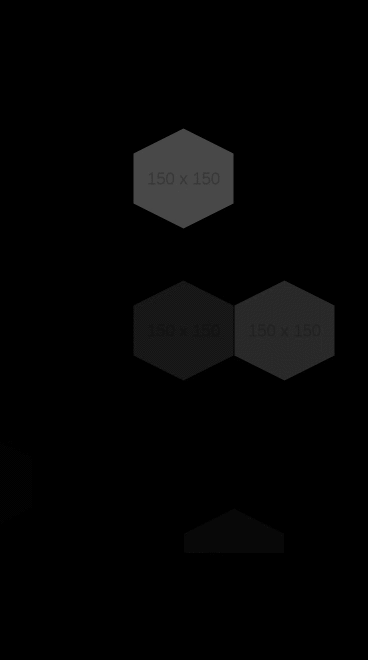

HoneycombView
========================

[](http://cocoadocs.org/docsets/HoneycombView)
[](https://developer.apple.com/iphone/index.action)
[](https://developer.apple.com/swift)
[](http://mit-license.org)

iOS UIView for Honeycomb layout. 


## Requirements
- iOS 8.0+
- Swift 1.2+
- ARC

##Installation

####CocoaPods
HoneycombView is available on CocoaPods. Just add the following to your project Podfile:
```
pod 'HoneycombView'
use_frameworks!
```

####Carthage
TODO

####Manually
Add the `HoneycombView.swift` directly into your project.

##Usage
The easiest way is to instantiate its class in ViewController, configure it, and add it to a view.
If you want to know more details, see the ViewController of the example project.

- With Images
```swift
  let honeycombView = HoneycombView(frame: CGRectMake(0, 0, view.frame.width, view.frame.height))
  honeycombView.diameter = 160.0
  honeycombView.margin = 1.0
  honeycombView.configrationForHoneycombViewWithImages(images)
  view.addSubview(honeycombView)
        
  honeycombView.animate(duration: 0.5)
```

You can also use from URL(String) with NSCache.

- With Images from URL
```swift
  for i in 0..<30{
    var user = User(id: i, profileImageURL: "https://placeimg.com/100/100/any")
    users.append(user)
  }
        
  let honeycombView = HoneycombView(frame: CGRectMake(0, 0, view.frame.width, view.frame.height))
  honeycombView.diameter = 200.0
  honeycombView.margin = 0.0
  honeycombView.configrationForHoneycombViewWithURL(users.map{ $0.profileImageURL })
  view.addSubview(honeycombView)

```

Other parameter is for size of HoneycombView.
Set margin parameter to 0 if you don't need margin for honeycomb.
- diameter
- margin



### Attention when using
The subviews of honeycombView will add to views automatically depends on the size of the diameter.
So don't specify diameter too small or you'll get heavy rendering.

## Contributing
Forks, patches and other feedback are welcome.

## Photos from 
- [Unsplash](https://unsplash.com)
- [PlaceImg](https://placeimg.com)

## License
HoneycombView is available under the MIT license. See the LICENSE file for more info.
